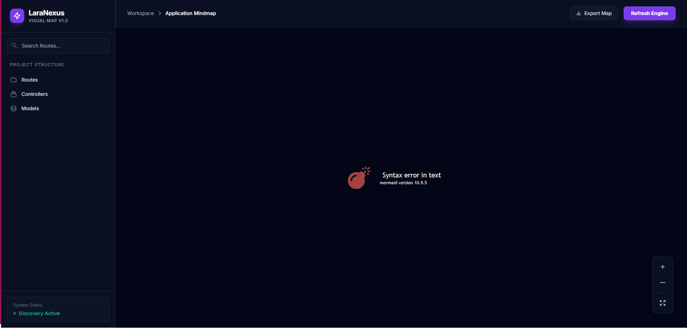

# LaraNexus 🚀

<p align="center">
    
</p>

<p align="center">
    <strong>LaraNexus</strong> is a premium visualization toolkit designed for Laravel architects. It transforms your complex application flows into an interactive, sleek, and intuitive mindmap.
</p>

<p align="center">
    <a href="#"></a>
    <a href="#"></a>
    <a href="#"></a>
    <a href="#"></a>
</p>



---

## ✨ Features

- 🗺️ **Interactive Mindmap:** View your entire application flow from Route to Method in a node-based graph.
- 🎨 **Premium UI:** Modern Dark-mode dashboard with Glassmorphism effects.
- 📊 **Visual Hierarchy:** Group routes by Controllers using Mermaid.js subgraphs.
- 🛡️ **Security Mapping:** Automated Middleware detection and visualization on the map.
- 🔍 **Deep Discovery:** Static analysis scanning of Controllers for Eloquent Models and Blade Views.
- 🛠 **IDE Connectivity:** Open any file directly in VS Code with a single click.
- 📑 **Project Tree:** Full hierarchical view of your application's source code.
- ⚡ **Live Search:** Real-time filtering of routes and controllers.
- 📤 **SVG Export:** Save your architecture map for documentation or presentations.
- 🛠️ **Zero Configuration:** Install and go. It works out of the box for standard and modular projects.
- 🔗 **Deep Connectivity:** (Coming Soon) Visualize Eloquent relationships and Service injections.

## 📦 Installation

You can install the package via composer:

```bash
composer require diusazzad/laranexus --dev
```

You can publish the config file with:

```bash
php artisan vendor:publish --tag="laranexus-config"
```

## 🚀 Usage

Once installed, simply visit your application's dashboard at:

`http://your-app.test/laranexus`

> [!NOTE]
> By default, the dashboard is only accessible in the `local` environment for security reasons.

## 📚 Learning Roadmap

Want to learn how this package was built from scratch? Check out our step-by-step documentation:
👉 **[The Learning Journey](learn/01_Initial_Strategy.md)**

## ⚙️ Configuration

The published configuration file `config/laranexus.php` allows you to customize:

- **Path:** Change the default `/laranexus` URI.
- **Middleware:** Add custom authentication or authorization middlewares.
- **Ignored Routes:** Exclude specific patterns (e.g., debug or internal routes).

## 🛡️ Security

If you discover any security-related issues, please email [diusazzad@gmail.com](mailto:diusazzad@gmail.com) instead of using the issue tracker.

## 🤝 Contributing

LaraNexus is an open-source project. If you'd like to contribute, please check our [Contribution Guide](CONTRIBUTING.md).

## 📄 License

The MIT License (MIT). Please see [License File](LICENSE.md) for more information.

---
<p align="center">Built with ❤️ for the Laravel Community by <a href="https://github.com/diusazzad">diusazzad</a></p>
